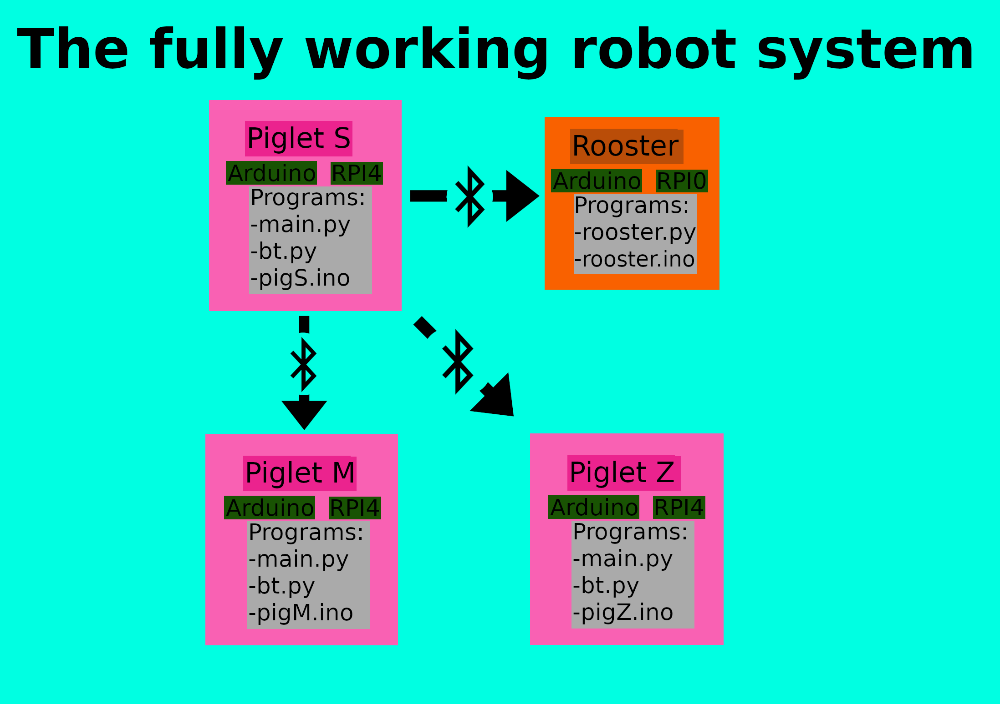
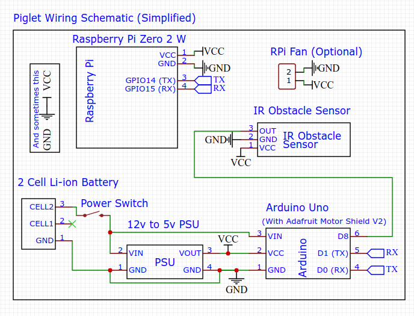

# Everything I use
Don't make a difference between "Pig" and "Piglet",
It's just me

# The Communication Diagram (TFWRS as I call it)

# PigS's Schematic (Simplified version (it's not up to date))

# How To Install

## Update pip
pip3 install --upgrade pip

## Install opencv
sudo pip3 install opencv-contrib-python

## Install bluetooth
sudo apt install bluetooth bluez libbluetooth-dev
sudo python3 -m pip install pybluez

## Stop ttyS0 service
sudo systemctl stop serial-getty@ttyS0.service

## Remove the two pieces related to serial from '/boot/cmdline.txt'
sudo nano /boot/cmdline.txt